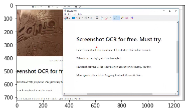

# Single Shot Text Recognizer
The following module performs single shot text detection and is capable of working on both image vector and complete image directories. In addition, it sets clear design scheme and pattern to perform simple and advanced Natural Language Processing on top of those images - and, essentially serves as a starting material for advanced NLP over images. 

## Suitability

This module is suitable for text-detection on optical characters including screenshots (arising from screen captures, optically embedded text on images, etc). The capabilities of this module stems from domain-specific data-preprocessing which could be extended externally before using the detection module. 


## Usage of main module: fetch_text_from_image

Parameters Invoked | Default Argument | Description
--- | --- | ----
alphanumeric | True | Returns only alphanumeric text. If switched off, it returns all possible characters detected in the image, including emoticons, etc. 
perform_nlp | True | Returns advanced analytics including the language of the detected text, grammatical corrections, stopword removal and frequent n-grams identification
custom_stopwords | empty array | If set, it removes all domain-specific stopwords (by default, it removes commmon english stopwords). 
top_k_ngrams | 10 | If set, it returns a custom length of stopwords. 
upper_ngram | 3 | If set, it returns n-grams combination with 'n' as high as defined by the variable upper_ngram. 
known_list_corrections | empty | Often while detecting text in images due to corruptions in images, 'y' is detected as 'v' etc. These could be avoided using domain knowledge and letting the recognizer correct them accordingly. 
correction | True | Performs pre-processing on the image before serving it to the recognizer module. Though currently it performs only auto-contrast, resolution and auto-brightness improvement, custom pre-processing can be defined in the same file, which will allow it to peform even advanced domain-specific corrections. I further envisioned creating these as a pipeline of cascaded modules flexible enough to be turned on and off. And, the design and implementation still supports such aspiration. 


## Usage Examples

```python
# Required packages (general)
from inference import fetch_text_from_image
from matplotlib.image import imread

# Demo-specific packages (not required for the working of this module) 
from matplotlib import pyplot as plt
```


```python
# Can handle both image variable and image location
img_file = 'demo_image/screenshot_ocr.jpg' # Sending input as an image array
im = imread(img_file)
plt.imshow(im)
```


    <matplotlib.image.AxesImage at 0x269d8339888>





```python
# Only recover all text, no fancy analytics (neither alphanumeric filtering) - Image-based correction is turned on
original_text, _ = fetch_text_from_image(im, alphanumeric=False, perform_nlp=False)
print (original_text)
```

    Normal ~ BI U a ”° 9
    
    GZ Snipping Too!
    File Edit Tools Help
    
    Qe New EB Mode ¥ i Delay ¥ fl [ig @.*
    
       
    
     
    
     
    
     
    
     
    
        
            
     
         
    
     
    
     
    
    Lor -|9
    
     
    
     
    
    Screenshot OCR for free. Must try.
    
    o
    I don’t understand why people are still protecting their online contents.
    
          
       
     
      
          
      
    
    When it can be displayed it can be copied.
    
      
    
    Microsoft delivers all the tools that you need at your doorstep. For free||
    
    eenshot OCR for fr
    
    More specifically. it is the Snipping Tool and Microsoft Notes.
    
    understand why people are still protecting th
    t can be displayed it can be copied.
    
    oft delivers all the tools that you need at your doorstep. For free.
    


```python
# Only recover all text, no fancy analytics, turning off image based correction (neither alphanumeric filtering)
original_text, _ = fetch_text_from_image(im, alphanumeric=False, perform_nlp=False, correction=False)
print (original_text)
```

    Ic
    :
    3
    &
    
    Normal ~ BI
    
     
    
    & Snipping Toot
    
      
    
    File Edit Tools Help
    
    Qnew Bmore ~ Soy +A 1B > -
    
     
    
     
    
    Pir =\9
    
     
    
    Screenshot OCR for free. Must try.
    
    .
    I don't understand why people are still protecting their online contents.
    
    When it can be displayed it can be copied.
    Microsoft delivers all the tools that you need at your doorstep. For free,
    
    eenshot OCR for f
    
    More specifically, it is the Sniping Tool and Microsoft Notes.
    
    understand why people are still protecting tl
    
     
    
    can be displayed it can be copied
    
    »ft delivers all the tools that you need at your doorstep. For free.
    


```python
# Only recover alphanumeric text, no fancy analytics
original_text, _ = fetch_text_from_image(im, perform_nlp=False)
print (original_text)
```

    Normal BI U a 9 GZ Snipping Too File Edit Tools Help Qe New EB Mode i Delay fl ig Lor 9 Screenshot OCR for free Must try o I don t understand why people are still protecting their online contents When it can be displayed it can be copied Microsoft delivers all the tools that you need at your doorstep For free eenshot OCR for fr More specifically it is the Snipping Tool and Microsoft Notes understand why people are still protecting th t can be displayed it can be copied oft delivers all the tools that you need at your doorstep For free 
    


```python
# Recover text, plus extra insights
cwords = ['ocr', 'snipping', 'screenshot'] # Window to provide custom stopwords
original_text, mapped_nlp = fetch_text_from_image(im, custom_stopwords=cwords, top_k_ngrams=20, upper_ngram=4)

print("Original Text = {}".format(original_text))
print ("====== **** ====== **** ====== **** ====== ****")
print("Corrected Text = {}".format(mapped_nlp[0]))
print ("====== **** ====== **** ====== **** ====== ****")
print ("Top N-grams = {}".format(mapped_nlp[1]))
print ("====== **** ====== **** ====== **** ====== ****")
print ("Detected Language = {}".format(mapped_nlp[2]))
```

    Original Text = Normal BI U a 9 GZ Snipping Too File Edit Tools Help Qe New EB Mode i Delay fl ig Lor 9 Screenshot OCR for free Must try o I don t understand why people are still protecting their online contents When it can be displayed it can be copied Microsoft delivers all the tools that you need at your doorstep For free eenshot OCR for fr More specifically it is the Snipping Tool and Microsoft Notes understand why people are still protecting th t can be displayed it can be copied oft delivers all the tools that you need at your doorstep For free 
    ====== **** ====== **** ====== **** ====== ****
    Corrected Text = Normal BI GZ File, Edit Tools Help Qe New EB Mode Delay FL ig Lor free Must try understand people still protecting online contents displayed copied Microsoft delivers tools need doorstep free on-site free specifically, Tool Microsoft Notes understand people still protecting
    ====== **** ====== **** ====== **** ====== ****
    Top N-grams = [(2, ('understand', 'people')), (2, ('people', 'still')), (2, ('still', 'protecting')), (2, ('understand', 'people', 'still')), (2, ('people', 'still', 'protecting')), (2, ('understand', 'people', 'still', 'protecting')), (1, ('normal', 'bi')), (1, ('bi', 'gz')), (1, ('gz', 'file,')), (1, ('file,', 'edit')), (1, ('edit', 'tools')), (1, ('tools', 'help')), (1, ('help', 'qe')), (1, ('qe', 'new')), (1, ('new', 'eb')), (1, ('eb', 'mode')), (1, ('mode', 'delay')), (1, ('delay', 'fl')), (1, ('fl', 'ig')), (1, ('ig', 'lor'))]
    ====== **** ====== **** ====== **** ====== ****
    Detected Language = English
    
